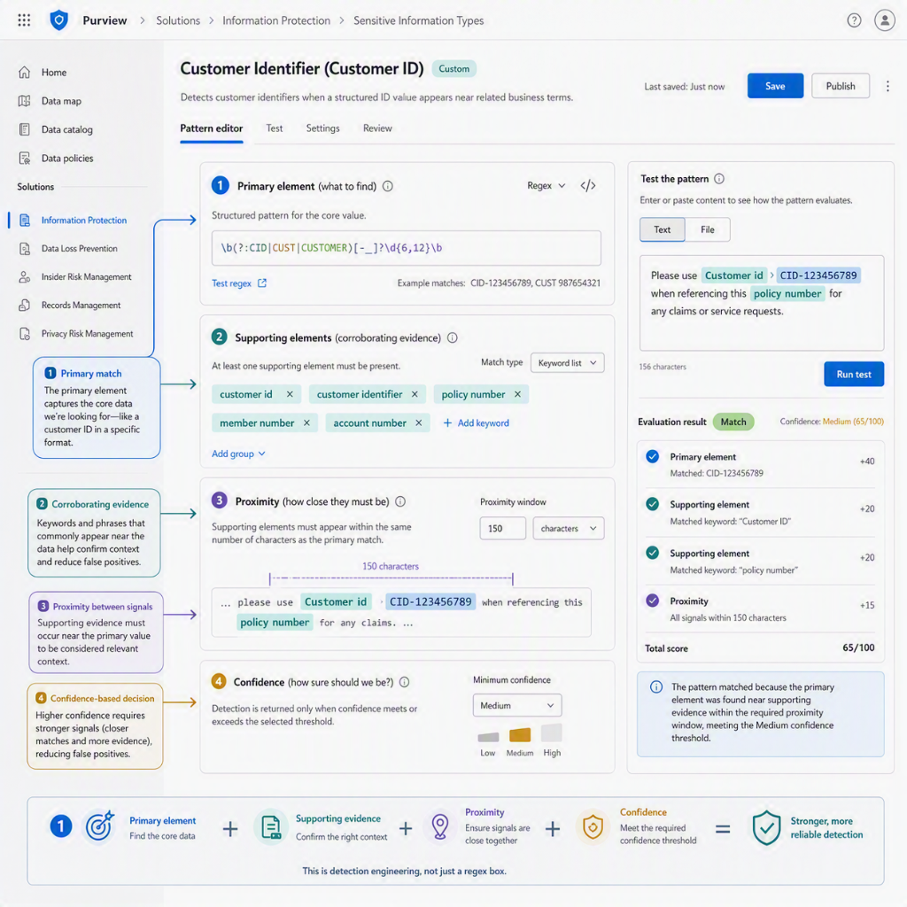

Sensitive Information Types, or SITs, show up all over Microsoft Purview. They sit inside DLP conditions, auto-labeling logic, investigations, Content Explorer views, and a surprising amount of "why did this trigger" troubleshooting. Because of that, they are easy to treat like a boring plumbing layer.

SITs are everywhere and they hold special power within Purview. This is why they deserve their own post.

If your SITs are noisy, weak, or badly tuned, everything built on top of them inherits that problem. Your DLP policies become annoying. Your auto-labeling gets timid or reckless. Your reports stop being trustworthy. And suddenly the conversation is not about protection anymore. It is about false positives and exceptions.

This post is a separate deep dive, not a numbered part of my practical Purview implementation series. If you need the rollout path first, start with [Microsoft Purview Sensitivity Labels, Part 1: How to Get Started and Reach a Fully Labeled Environment](/posts/purview-sensitivity-labels-getting-started/) and [Microsoft Purview DLP, Part 2: How to Move from Labels to Enforcement](/posts/microsoft-purview-dlp-move-from-labels-to-enforcement/). This one is about the detection layer itself: what SITs actually are, how they work, and how I would configure them without turning Purview into a regex museum.

## Skip to the good part

- [What sensitive information types actually are](#what-sensitive-information-types-actually-are)
- [Where SITs fit in Purview](#where-sits-fit-in-purview)
- [How SIT detection actually works](#how-sit-detection-actually-works)
- [Built-in, custom, named entity, and exact data match SITs](#built-in-custom-named-entity-and-exact-data-match-sits)
- [When SITs are the wrong tool](#when-sits-are-the-wrong-tool)
- [How I would configure SITs effectively](#how-i-would-configure-sits-effectively)
- [How to test and tune them](#how-to-test-and-tune-them)
- [Common mistakes](#common-mistakes)
- [Conclusion](#conclusion)

## What sensitive information types actually are

Microsoft describes SITs as pattern-based classifiers. That is the right mental model.

They are not labels.

They are not business taxonomy.

They are not magic context engines.

They are detection logic that looks for recognizable patterns of sensitive information, such as credit card numbers, bank account numbers, national identifiers, health identifiers, credentials, or organization-specific values you define yourself. Purview uses those detections across DLP, sensitivity labels, retention labels, Insider Risk Management, Communication Compliance, auto-labeling, and other classification-driven features. [Learn about sensitive information types](https://learn.microsoft.com/purview/sit-sensitive-information-type-learn-about){:target="_blank"} is the core Microsoft reference here.

That means SITs matter well beyond DLP. They are one of the main signals Purview uses when it tries to decide whether content deserves a closer look.

## Where SITs fit in Purview

I think it helps to separate the layers.

- SITs help identify what kind of sensitive information may be present.
- Sensitivity labels help express how content should be classified and protected.
- DLP decides what users are allowed to do when that content is used, shared, or moved.

That sounds obvious until a project starts mixing those layers together.

If someone says "we will solve this with a SIT", that is often incomplete. A SIT can detect a possible customer ID, passport number, or insurance number. It does not, by itself, decide whether the item should be encrypted, blocked from external sharing, retained for seven years, or escalated to an incident queue.

It is one detector in the wider control chain.

That is also why bad SIT design is expensive. Bad detection logic quietly poisons the controls above it.

## How SIT detection actually works

This is the part I think more people should understand before they start building custom SITs.

Microsoft breaks a SIT pattern into four practical components:

- a primary element
- supporting elements
- confidence level
- proximity

The primary element is the main thing you are looking for. That can be a regular expression, a keyword list, a keyword dictionary, or a function. Supporting elements are corroborative evidence near the primary element, such as surrounding keywords, another pattern, or other context that makes the match more believable. Proximity defines how close that evidence must be. Confidence defines how much evidence is required before Purview treats the match as low, medium, or high confidence. [Learn about sensitive information types](https://learn.microsoft.com/purview/sit-sensitive-information-type-learn-about#fundamental-parts-of-a-sensitive-information-type){:target="_blank"} explains the model in detail.

That sounds abstract, so here is the practical version.

If your custom SIT is trying to detect an internal customer number, the regex might match the number format itself. But if that same number format also appears in invoices, ticket IDs, random exports, or old line-of-business junk, regex alone is not enough. Supporting evidence like `customer number`, `customer id`, a nearby name field, or another corroborating data point can turn a weak pattern into a usable one.

Confidence matters more than many first implementations admit but as with anything that tries to detect something, tuning is very important.

- high confidence reduces false positives but increases false negatives
- low confidence catches more potential matches but also creates more noise

Microsoft also recommends a practical pattern that I agree with: use high-confidence patterns with low counts, and use low-confidence patterns with higher counts. That makes sense because blocking or auto-labeling on a shaky low-confidence single hit is a nice way to create operational pain.

Below is an informational picture of SITs (generated with AI but looks better than in Purview portal.. Ahem Purview team ;))

## Built-in, custom, named entity, and exact data match SITs

Not all SITs solve the same problem, and many implementations get worse because people force everything through one method.

### Built-in SITs

Built-in SITs are the default starting point. Microsoft ships a large catalog of them, and they already include pattern logic, supporting evidence, and confidence behavior. You cannot edit the built-in version directly, but you can often copy one and tune the copy. That is usually a better first move than creating everything from scratch. [Sensitive information type entity definitions](https://learn.microsoft.com/purview/sit-sensitive-information-type-entity-definitions){:target="_blank"} is the catalog worth browsing before you invent anything new.

### Named entity SITs

Named entity SITs are also built in, but they are a separate category. They are aimed at things like names, physical addresses, and medical terms. Microsoft splits them into narrower unbundled versions and broader bundled versions. That matters in DLP design because broad detection can be useful for discovery and a terrible idea for aggressive enforcement. Microsoft also notes that bundled named entity SITs in endpoint DLP require Advanced classification scanning and protection to be enabled. [Learn about sensitive information types](https://learn.microsoft.com/purview/sit-sensitive-information-type-learn-about#categories-of-sensitive-information-types){:target="_blank"} covers that detail.

### Custom SITs

Custom SITs are for the cases where the built-in catalog is not enough. That usually means one of these:

- you have internal identifiers or codes Microsoft would never know about
- you need to tighten a built-in pattern for your environment
- you need different evidence rules than the Microsoft default

Microsoft's custom SIT guidance is worth reading carefully because it includes some practical implementation constraints people often discover the hard way. For example, Purview custom regex patterns should not use positional anchors like `^` and `$`, and the regex design must follow specific capturing-group rules. [Create custom sensitive information types](https://learn.microsoft.com/purview/sit-create-a-custom-sensitive-information-type){:target="_blank"} is the page I would keep open while building.

Also a good regex validator like [Regex 101](https://regex101.com){:target="_blank"} is useful.

### Exact Data Match

Exact Data Match, or EDM, is where SIT design gets much more precise.

EDM is for cases where you have a real source of truth and you want exact or near-exact matching against that data rather than generic pattern matching. Microsoft describes EDM as dynamic, refreshable, lower-noise, and suited to structured data. The uploaded data is hashed and salted rather than sent in the clear, and the reference data can be refreshed daily with support for very large datasets. [Learn about exact data match based sensitive information types](https://learn.microsoft.com/purview/sit-learn-about-exact-data-match-based-sits){:target="_blank"} is the key reference.

This is where I think many teams should pause and ask a harder question.

If you already have an authoritative list of employee numbers, policy numbers, customer IDs, or case IDs, why are you trying to solve that with a fragile regex and a keyword like `customer` nearby?

Sometimes the right answer is still custom regex. But often the better answer is EDM.

## When SITs are the wrong tool

This is an important design boundary.

SITs are good at pattern-based detection. They are not the answer to every classification problem.

If your goal is to identify a class of documents such as contracts, resumes, strategy decks, or procurement documents, a trainable classifier is often the better fit because the problem is document meaning, not just structured data patterns. Microsoft treats SITs and trainable classifiers as separate classification approaches for exactly that reason. [Classifiers overview](https://learn.microsoft.com/purview/data-classification-overview){:target="_blank"} is useful background.

Likewise, if the success of your control depends on exact business records rather than broad format recognition, EDM is usually the better tool than a normal custom SIT.

One more practical boundary matters too: if you expect Purview to detect sensitive data inside screenshots, scanned PDFs, or image-based files, that is not just a SIT design problem. OCR is a separate prerequisite in Purview for image-based detection scenarios.

## How I would configure SITs effectively

I would keep the design approach a lot more boring than many teams do.

### Start from the action, not from the regex

Before creating a SIT, I would want a simple answer to this question: what happens if this detection fires?

If the outcome is only reporting or discovery, you can tolerate more noise. If the outcome is auto-labeling, blocking, or an investigation workflow, the quality bar is much higher.

That one decision should influence confidence, count thresholds, evidence requirements, and whether you should use built-in SITs, custom SITs, or EDM.

### Prefer copying and tuning over inventing

If Microsoft already has a built-in SIT that is close to your use case, I would start there. Copy it, tighten it, and test it.

Creating a new SIT from scratch is justified when the problem is truly tenant-specific. It is not a badge of maturity.

### Make the primary element narrow enough to deserve trust

A broad regex is not a design. It is an invitation to spend your next month in Content Explorer explaining why the match count is ridiculous.

Use validators when the pattern supports them. Use format rules that reflect reality. If the real identifier has a fixed prefix, a checksum, a delimiter rule, or a known length, encode that.

I would also avoid regex-only designs for anything that might eventually trigger user-facing control actions.

### Add supporting evidence that matches real business context

Supporting evidence should not be random keyword decoration. It should reflect how the data actually appears in your environment.

Good supporting evidence might include:

- nearby field names
- document terminology from the owning process
- another data element that commonly appears with the primary value
- a keyword dictionary of tenant-specific terms

The goal is not to make the pattern look sophisticated. The goal is to make it less wrong.

### Tune proximity and confidence for the control you are building

This is where many SITs either become too timid or too noisy.

For blocking or auto-labeling, I prefer stricter evidence and higher confidence. For exploratory discovery or early reporting, I can live with broader detection and more review effort.

I also like separating the logic in my head this way:

- discovery can afford curiosity
- enforcement needs restraint

### Use Exact Data Match (EDM) when a source of truth exists

If the data you are trying to detect already exists in a structured system of record, EDM deserves serious consideration.

I would especially look at EDM when:

- false positives would be costly
- the identifier values change over time
- the detection needs to follow exact business records
- the content may contain legitimate number-like strings that look similar

Microsoft's EDM model also supports multiple supporting fields and multi-token matching, which is useful for names, addresses, and other corroborative values that are not a single simple token.

### Design for operational scale, not only the lab

One detail in the Microsoft guidance deserves more attention than it gets: endpoint DLP classifies files based on all SITs available in the tenant, including custom SITs, regardless of whether they are actively used in a DLP policy. Microsoft explicitly warns that badly tuned SITs can create excessive classification traffic. [Learn about sensitive information types](https://learn.microsoft.com/purview/sit-sensitive-information-type-learn-about#tuning-trainable-classifiers){:target="_blank"} calls this out.

That means custom SIT hygiene matters.

Remove unused ones. Fix broad ones. Do not let the tenant accumulate classification debris forever.

## How to test and tune them

I would treat SIT design like detection engineering, not like a one-time wizard.

Microsoft lets you test SITs with sample files and see match counts by confidence level. That should be the first validation step, not the last. [Test sensitive information types](https://learn.microsoft.com/purview/sit-sensitive-information-type-learn-about#test-sensitive-information-type){:target="_blank"} is built into the admin flow for a reason.

After the lab-style test, I would validate in real content views:

- check the SIT against representative sample files
- review detections in Content Explorer
- use match and not-a-match feedback where the portal supports it
- compare false positives against the actual business use case
- only after that move into simulation, policy tips, auto-labeling, or enforcement

There is also an important SharePoint and OneDrive detail in Microsoft's custom SIT guidance: if you want new custom SIT logic to identify existing content, the content may need to be recrawled or reindexed before the results catch up. [Create custom sensitive information types](https://learn.microsoft.com/purview/sit-create-a-custom-sensitive-information-type){:target="_blank"} mentions this explicitly.

That matters because a lot of people build a new SIT, wait a bit, see nothing, and assume the pattern is broken when the crawl state is part of the story.

## Common mistakes

I think SIT projects usually go sideways in familiar ways.

### Treating SITs like labels

They are not the same thing. SITs detect. Labels classify and protect. DLP enforces.

### Building custom SITs before checking the built-in catalog

This wastes time and often produces worse detection than the Microsoft baseline.

### Trusting regex alone

If the pattern is broad and the surrounding evidence is weak, the policy will inherit that weakness.

### Using low-confidence detections for hard enforcement

That is a good way to turn classification into a user-support problem.

### Ignoring the EDM option

If you have an authoritative dataset, forcing everything through normal regex patterns is sometimes just self-inflicted pain.

### Never tuning after go-live

Detection logic is not finished because the portal saved it. Review and adjustment are part of the lifecycle.

### Letting old custom SITs pile up

Bad or unused custom SITs are not harmless. They add noise, maintenance burden, and in some scenarios unnecessary classification overhead.

## Conclusion

Sensitive Information Types are one of the least glamorous and most important layers in Microsoft Purview. They sit underneath a lot of the features people care about, and their quality shapes whether the controls above them feel precise or irritating.

I would keep the approach simple: start from a real use case, prefer built-in logic when it is close enough, add evidence instead of trusting raw regex, use EDM when exact records matter, and test against real content before you let the result affect users.

If you want the broader Purview context first, start with [Microsoft Purview: What Is It and Why Do I Need It?](https://jerehaavisto.com/purview/2026/04/08/microsoft-purview-what-is-it-and-why-do-i-need-it.html). If you are specifically building the protection path, the most natural companion reads are [Microsoft Purview Sensitivity Labels, Part 1: How to Get Started and Reach a Fully Labeled Environment](https://jerehaavisto.com/purview/2026/05/27/purview-sensitivity-labels-getting-started.html) and [Microsoft Purview DLP, Part 2: How to Move from Labels to Enforcement](https://jerehaavisto.com/purview/2026/06/10/microsoft-purview-dlp-move-from-labels-to-enforcement.html).
