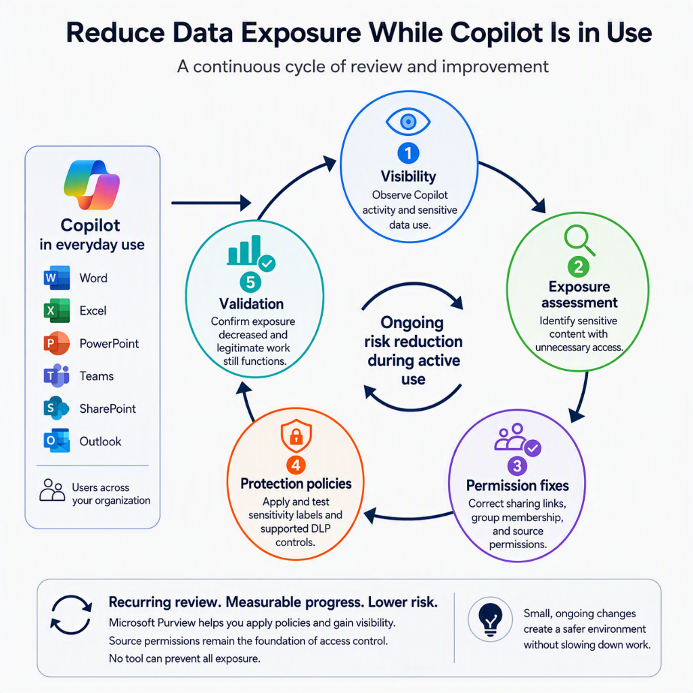

Copilot is already in use. People are summarizing meetings, asking questions about documents, and creating new content from whatever they can access. The data security work does not get to wait for a perfect readiness project. Perfection is the enemy of good enough! This

That is the starting point for this post. I am not asking whether the organization is ready to enable Microsoft 365 Copilot. I am asking how I would reduce data exposure now that it is part of everyday work.

AI does not invent your permissions problem. It can make the weak parts easier to find and the consequences harder to ignore. That is why I think Microsoft Purview matters more when Copilot is already being used, not just when somebody is preparing a rollout slide deck.

This post sits alongside my practical Microsoft Purview implementation series. I would reuse whatever labels, DLP policies, retention settings, and operational reviews already exist. If those foundations are incomplete, I would treat the gaps as a prioritized remediation backlog rather than pretend the organization can start again from a clean slate.

## Skip to the good part

- [Why AI changes the risk conversation](#why-ai-changes-the-risk-conversation)
- [What Microsoft Purview can actually do for Copilot](#what-microsoft-purview-can-actually-do-for-copilot)
- [What I would check while Copilot is already in use](#what-i-would-check-while-copilot-is-already-in-use)
- [How I would reduce exposure without starting over](#how-i-would-reduce-exposure-without-starting-over)
- [Common mistakes](#common-mistakes)
- [Conclusion](#conclusion)

## Why AI changes the risk conversation

The uncomfortable moment is often when Copilot surfaces something that a user technically had access to, but nobody expected them to find. Or when Copilot generates content based off some confidential document.

Microsoft 365 Copilot respects the user's existing access permissions. That does not mean those permissions are appropriate. A broadly shared HR document is still broadly shared even if nobody remembered the link until Copilot made the content useful.

I would separate three questions: could the user access the source, should they have been able to, and what happened to the information afterward? An unexpected answer is a reason to investigate, not automatic proof that Copilot bypassed security or that data left the organization.

The source content is only one part of the picture. Prompts, responses, uploaded files, and generated documents also need appropriate protection and lifecycle decisions. I want to reduce exposure across that flow, not just make one surprising search result disappear.

## What Microsoft Purview can actually do for Copilot

I think the first useful thing is to avoid magical thinking.

Microsoft Purview is not a switch that makes Copilot safe. It gives me controls and evidence to understand how sensitive data is being used, apply protection in supported scenarios, and investigate when something needs attention. It does not replace fixing access in SharePoint, OneDrive, Teams, or Exchange.

Good news is that there are some "mitigations" even if the access is all over the place. Limiting what Sensitive Information or Labels can be used in Copilot experiences will help you get things into motion. This still doesn´t replace the grueling work ahead if the basics are a mess.

For Microsoft 365 Copilot and Copilot Chat, the useful pieces include:

- Audit and Activity Explorer for visibility into supported Copilot activities.
- Data classification and sensitivity labels to identify sensitive content and, where configured, apply protection such as encryption.
- DLP for supported sharing paths and Copilot-specific processing restrictions.
- Data Lifecycle Management for retaining or deleting prompts and responses.
- DSPM for risk visibility, policy coverage, and prioritized remediation.
- Insider Risk Management and eDiscovery when a risk or investigation justifies their use.

Microsoft's [guidance for Microsoft 365 Copilot and Microsoft Purview](https://learn.microsoft.com/purview/ai-m365-copilot){:target="_blank"} is the main reference for these capabilities. I would check licensing, permissions, and supported experiences before assuming a control covers every Copilot interaction.

### Chat history and files need separate lifecycle decisions

I would review retention early. Prompts and responses can contain sensitive information, and keeping them indefinitely should be a decision rather than an accident.

Purview retention policies can target **Microsoft Copilot Experiences** for prompts and responses. I would agree the retention and deletion requirements with legal, privacy, and the business, then test the outcome. There is no universal number of days, and a delete policy is not an instant purge: processing delays and applicable holds matter. Microsoft's [retention guidance for Copilot and AI apps](https://learn.microsoft.com/purview/retention-policies-copilot){:target="_blank"} explains those boundaries.

Files uploaded or generated in a Copilot workflow are a separate concern. Where those files are stored in OneDrive or SharePoint, I would review the policies for those locations. The Copilot interaction retention policy is not a cleanup policy for the user's OneDrive.

Content-based auto-labeling can help, but I would distinguish sensitivity labels for classification and protection from retention labels for lifecycle. Applying a sensitivity label does not, by itself, set a deletion schedule. Purview also supports auto-applying retention labels to preserve versions of files referenced in Copilot through its [cloud attachment retention capabilities](https://learn.microsoft.com/purview/retention-policies-sharepoint#how-retention-works-with-cloud-attachments){:target="_blank"}. Preservation and cleanup are different goals.

### Use DSPM to prioritize, not to declare the job finished

Microsoft now distinguishes the current [Data Security Posture Management](https://learn.microsoft.com/purview/data-security-posture-management-learn-about){:target="_blank"} experience from [DSPM for AI (classic)](https://learn.microsoft.com/purview/dspm-for-ai){:target="_blank"}. I would start with the current DSPM guidance and use the documentation that matches the experience available in the tenant.

The useful outcome is a list of risks I can assign and remediate. A recommendation marked complete is not a substitute for checking whether the underlying exposure changed.

## What I would check while Copilot is already in use

I would start with direct answers to a few operational questions:

- Which Copilot experiences are people actually using, and what visibility do I have into them?
- Is auditing enabled, can I find a known test interaction, and who reviews the results?
- Which sensitive sites and files are accessible to audiences that do not need them?
- Are the important files labeled, and do those labels apply the protection I expect?
- Which DLP policies cover Copilot processing, and which only cover other sharing paths?
- What happens to prompts, responses, and files when their useful life ends?
- Who owns remediation, and who is authorized to inspect interaction content?

I would not wait for a complete inventory before fixing an obvious exposure. Equally, I would not confuse missing telemetry with proof that nothing risky happened. Turning on visibility now does not recreate evidence that was never captured or is no longer retained.

## How I would reduce exposure without starting over

My default approach would be fairly boring, which is exactly what I want for a service people already depend on.

### Establish a baseline I can investigate

I would confirm auditing, review available Copilot activity in Purview, and test what I can actually see. Activity Explorer helps with operational review; Audit supports deeper investigation. Access to prompt and response content needs appropriate roles and an agreed privacy boundary, not a blanket invitation for administrators to read everyone's work.

I would also name the person or team responsible for reviewing findings. An enabled dashboard without an owner is not an operational control.

### Fix the highest-risk access first

I would combine DSPM findings with input from data owners to prioritize sensitive, broadly accessible content. HR, finance, legal, and customer data are obvious places to look, but the actual exposure should determine the order.

Then I would fix unnecessary sharing links, group membership, and permissions with the relevant Microsoft 365 owners. Copilot-specific restrictions can help contain a supported scenario, but they do not repair access to the source. If the user can still open the file directly, that remains part of the risk.

If I find evidence of an actual incident, I would use the incident response process and preserve the necessary evidence rather than treat it as routine housekeeping.

### Apply targeted protection and test the boundaries

I would improve label coverage on the highest-value data and check the label settings, not just the label names. A label that applies encryption is different from one that only displays a classification. Auto-labeling can help close coverage gaps, but I would test matches and impact before broad enforcement.

For Copilot-specific DLP, Microsoft documents restrictions on processing files and emails with selected sensitivity labels. An excluded item can still appear in citations, so I would not describe that control as making the file invisible or removing the user's access.

Sensitive-information-type blocking for prompts is documented as preview and rolling out. I would verify availability in the tenant before relying on it. Microsoft also explicitly notes that the Copilot DLP location does not scan the contents of files uploaded directly into prompts; checking typed prompt text is not the same as inspecting an attachment.

These are reasons to test the exact experience, not reasons to ignore DLP. The [Copilot and Copilot Chat DLP guidance](https://learn.microsoft.com/purview/dlp-microsoft365-copilot-location-learn-about){:target="_blank"} documents the supported controls and limitations. I would use simulation where supported, validate with non-sensitive test content, and explain the expected impact to affected users.

### Review whether exposure actually decreased

After changes have taken effect, I would repeat the relevant assessments and test the same scenarios. Can the unintended audience still access the source? Does the protection policy behave as expected? Can legitimate users still do their work?

I would track unresolved high-risk sharing, label coverage, policy matches, and overdue remediation. More alerts after enabling visibility do not automatically mean the environment became less secure. The measure I care about is whether confirmed exposure is being reduced and new findings are being handled.

That becomes a recurring review with security, Microsoft 365 owners, and the business. It is not a Copilot project that ends when the licenses are assigned.

## Common mistakes

I think organizations managing Copilot in production tend to fall into familiar traps.

### Treating AI risk like a separate universe

Much of it is the same old data security problem, with faster discovery and more nervous executives. I would connect Copilot findings to the existing data security process rather than create a separate backlog nobody owns.

### Assuming labels solve oversharing by themselves

Labels can enforce protection when configured to do so. But a classification-only label does not fix permissions, and a mislabeled file may miss the intended controls. I would validate both coverage and configuration.

### Treating retention as protection

Keeping or deleting a conversation does not decide whether Copilot can use the source content. I need lifecycle controls and access controls, and I would not assume deleting chat history also deletes its files or preserved compliance copies.

### Enabling monitoring without an operational owner

Collecting activity is only the beginning. I need a review cadence, a privacy boundary, and a route from a finding to a person who can fix it.

### Assuming one policy covers every Copilot surface

Supported apps, file types, licensing, and preview availability matter. I would test the actual user workflow rather than infer protection from a policy name.

### Thinking security can solve this alone

Fixing exposure involves Microsoft 365 ownership, data owners, privacy, legal, and business decisions about acceptable use. Security can coordinate the work, but it cannot decide every permission or retention requirement alone.

## Conclusion

When Copilot is already in use, I would stop treating data security as a prerequisite that somebody missed and start treating it as operational work that needs an owner.

My starting point would be visibility, the highest-risk access fixes, targeted protection, and clear lifecycle decisions. Then I would test the result and repeat. Purview helps me find and manage the risk, but the outcome depends on whether the organization actually changes how its data is accessed and handled.

If you want the broader context, start with my earlier post [Microsoft Purview: What Is It and Why Do I Need It?](https://jerehaavisto.com/purview/2026/04/08/microsoft-purview-what-is-it-and-why-do-i-need-it.html). The same implementation disciplines still apply. Copilot being live simply makes the work more urgent.
